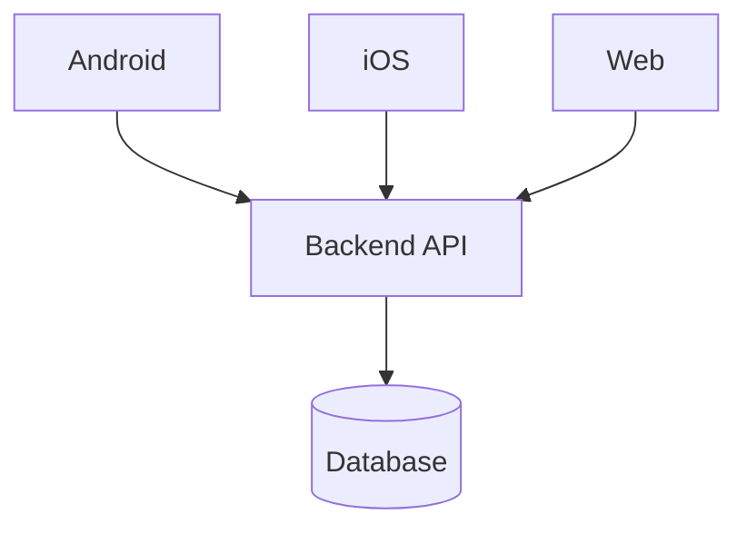

# TRD (Hub): <feature name>

> The **hub** holds everything shared across platforms — the single source of truth.
> Each platform team grooms its own spoke (`TRD-backend.md`, `TRD-android.md`,
> `TRD-ios.md`, `TRD-web.md`) which links back here. Never copy the API contract
> into a spoke — link to it, so it can't drift.

| | |
|---|---|
| **Status** | Draft |
| **Author** | <engineer> |
| **Platforms in scope** | <Backend / Android / iOS / Web> |
| **Spokes** | <links to the per-platform TRDs that exist> |
| **PRD/BRD** | <link to source> |
| **Figma** | <link, if any> |
| **Date** | <YYYY-MM-DD> |

## 1. Context / scope
_Approved: <YYYY-MM-DD>_

<Why this exists, what problem it solves, what's explicitly out of scope.>

## 2. System design
_Approved: <YYYY-MM-DD>_

<End-to-end picture: which clients and services are involved and how they interact.>

**Approach (ladder rung):** <required — name the rung the overall approach stops at, e.g. "rung 2: reuse existing balance + QRIS APIs, no new backend">

## 3. API contracts
_Approved: <YYYY-MM-DD>_

<The backend↔client contract — the shared truth every spoke references. Method, path, request, response, errors.>

| Method | Path | Request | Response | Notes |
|--------|------|---------|----------|-------|
| | | | | |

## 4. Cross-cutting concerns
_Approved: <YYYY-MM-DD>_

<Things every platform must agree on: auth, error model, API versioning & backward compatibility, feature flags, i18n/localization, analytics events.>

## 5. Change manifest
_Approved: <YYYY-MM-DD>_

> Structured handoff. Feeds ticket-slicing and monitoring.

**Repos / modules touched** (per platform)
- Backend: <service> → see `TRD-backend.md`
- Android: <module> → see `TRD-android.md`
- iOS: <module> → see `TRD-ios.md`
- Web: <module> → see `TRD-web.md`

**Cross-platform release ordering**
- <e.g. backend ships first behind flag → clients adopt → enable flag>

**Dependencies & risks (cross-platform)**
- <item>

**Work slice summary** (details live in each spoke)
- [ ] [BE] <slice>
- [ ] [Android] <slice>
- [ ] [iOS] <slice>
- [ ] [Web] <slice>
