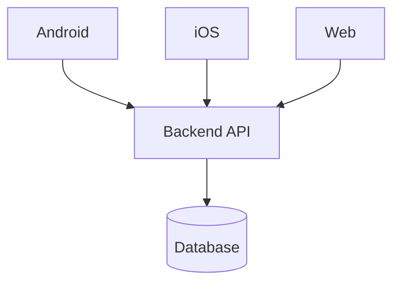

# TRD (Hub): <feature name>

> The **hub** holds everything shared across platforms — the single source of truth.
> Each platform team grooms its own spoke (`TRD-backend.md`, `TRD-android.md`,
> `TRD-ios.md`, `TRD-web.md`) which links back here. Never copy the API contract
> into a spoke — link to it, so it can't drift.

| | |
|---|---|
| **Status** | Draft |
| **Author** | <engineer> |
| **Platforms in scope** | <Backend / Android / iOS / Web> |
| **Spokes** | <links to the per-platform TRDs that exist> |
| **PRD/BRD** | <link to source> |
| **Figma** | <link, if any> |
| **Date** | <YYYY-MM-DD> |

## 1. Context / scope
_Approved: <YYYY-MM-DD>_

<Why this exists, what problem it solves, what's explicitly out of scope.>

## 2. Feature dependencies
_Approved: <YYYY-MM-DD>_

> How this feature relates to **other features** — so a dependency is reused/sequenced, not missed.
> Grounded in `docs/basics/16-feature-map.md` + sibling feature TRDs; register this feature in the map.

| Depends on / relates to | Kind | Integration points | Status | Blocking? |
|-------------------------|------|---------------------|--------|-----------|
| <menu-categories> | depends-on (reuse) | <needs category id + list from `GET /categories`> | shipped | no |
| <payments-v2> | prerequisite (not built) | <needs its charge API> | planned | **YES → Open Decision** |

- **Kinds:** depends-on (reuse an existing feature's contract/data/UI — don't break it) · prerequisite (must be built first) · shared-contract (extends a model another feature owns).
- **Hard rule:** a **prerequisite that isn't built yet blocks the affected slice** → raise it as an **Open Decision** in the spoke; it's built/decided before the dependent slice proceeds. Never design around a phantom.

**Flow dependencies (field / section grain)** — specific inputs/sections whose data flows from another feature:

| Consuming element (field / section) | Direction | Source feature · flow / endpoint | Data contract | Data-flow test |
|-------------------------------------|-----------|----------------------------------|---------------|----------------|
| <item-create → options dropdown> | consumes-options-from | <templates · `GET /templates/:id/options`> | <`{id,label}[]`> | <create template w/ options → dropdown shows them> |
| <category page → items list> | displays-created-by | <menu-items · `POST /items` → `GET /items?cat=`> | <item shape> | <create item → it appears in the list> |

- **Direction:** consumes-options-from (an input's options/values come from the source) · displays-created-by (a list/section shows entities the source creates) · writes-to (this feature feeds the source).
- Each binding gets a **mandatory cross-feature data-flow test** in `do-testing` (seed/create in the source → assert it flows into this feature's field/section, real data). A broken binding is a bug; an untested one is a coverage gap.

## 3. System design
_Approved: <YYYY-MM-DD>_

<End-to-end picture: which clients and services are involved and how they interact.>

**Approach (ladder rung):** <required — name the rung the overall approach stops at, e.g. "rung 2: reuse existing balance + QRIS APIs, no new backend">

## 4. API contracts
_Approved: <YYYY-MM-DD>_

<The backend↔client contract — the shared truth every spoke references. Method, path, request, response, errors.>

**Machine-checkable spec:** <required — path/link to the authoritative OpenAPI/Swagger (or shared schema/types) file, and which repo owns it. Clients derive their typed client + test fixtures from this, not from the table below. If none exists yet, that's a work slice.>

> The table is a human-readable summary of the spec above — not a second source of truth.
> Specify fields **precisely**: exact type, nullability, enum values, and **localized fields as
> objects** (e.g. `name: { en, id }`, never `string`). Loose types are what let a client send the
> wrong method (→ 405) or render an object as a string (→ React "objects are not valid as a child").

| Method | Path | Request (typed) | Response (typed) | Errors | Notes |
|--------|------|-----------------|------------------|--------|-------|
| | | | | | |

## 5. Cross-cutting concerns
_Approved: <YYYY-MM-DD>_

<Things every platform must agree on: auth, error model, API versioning & backward compatibility, feature flags, i18n/localization, analytics events.>

## 6. Change manifest
_Approved: <YYYY-MM-DD>_

> Structured handoff. Feeds ticket-slicing and monitoring.

**Repos / modules touched** (per platform)
- Backend: <service> → see `TRD-backend.md`
- Android: <module> → see `TRD-android.md`
- iOS: <module> → see `TRD-ios.md`
- Web: <module> → see `TRD-web.md`

**Cross-platform release ordering**
- <e.g. backend ships first behind flag → clients adopt → enable flag>

**Dependencies & risks (cross-platform)**
- <item>

**Work slice summary** (details live in each spoke)
- [ ] [BE] <slice>
- [ ] [Android] <slice>
- [ ] [iOS] <slice>
- [ ] [Web] <slice>
