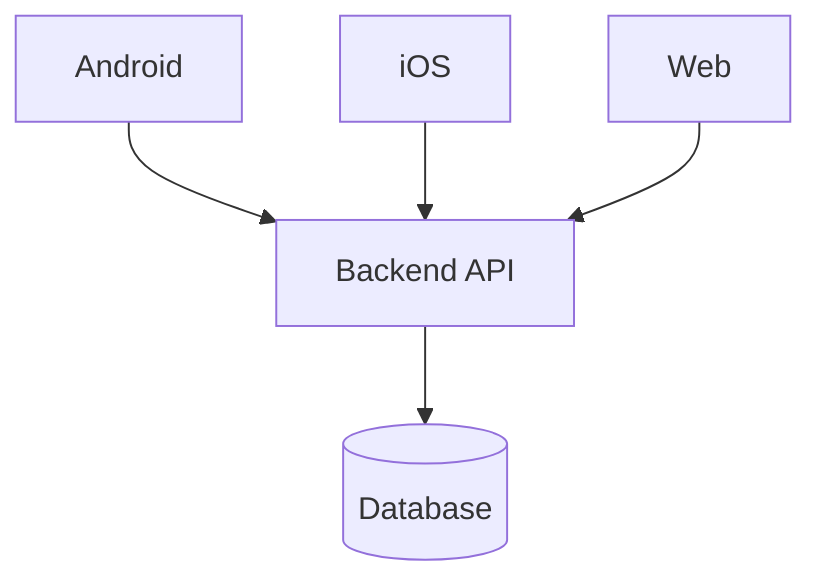

# TRD (Hub): <feature name>

> The **hub** holds everything shared across platforms — the single source of truth.
> Each platform team grooms its own spoke (`TRD-backend.md`, `TRD-android.md`,
> `TRD-ios.md`, `TRD-web.md`) which links back here. Never copy the API contract
> into a spoke — link to it, so it can't drift.

| | |
|---|---|
| **Status** | Draft |
| **Author** | <engineer> |
| **Platforms in scope** | <Backend / Android / iOS / Web> |
| **Spokes** | <see the *Spokes & alignment* table below> |
| **PRD/BRD** | <link to source> |
| **Figma** | <link, if any> |
| **Date** | <YYYY-MM-DD> |

## Spokes & alignment

> Each spoke's **hub-alignment** state, visible from the hub so drift is obvious here rather than
> discovered in development. **Editing any hub section below makes every ✅ stale** — re-run the
> hub-alignment review per spoke and re-stamp. `do-planning` won't plan a spoke that isn't aligned
> with the hub's current state.

| Spoke | Link | Hub alignment | Platform exceptions (decided divergences) |
|-------|------|---------------|-------------------------------------------|
| <backend> | [TRD-backend.md](./TRD-backend.md) | <✅ reviewed YYYY-MM-DD · hub rev `<hash/date>` · or ⚠️ stale · or ❌ not reviewed> | <none — or the decided exception + why, recorded here so the next spoke and `do-development` see it> |
| <android> | <…> | | |

## 1. Context / scope
_Approved: <YYYY-MM-DD>_

<Why this exists, what problem it solves, what's explicitly out of scope.>

## 2. Feature dependencies
_Approved: <YYYY-MM-DD>_

> How this feature relates to **other features** — so a dependency is reused/sequenced, not missed.
> Grounded in `docs/basics/16-feature-map.md` + sibling feature TRDs; register this feature in the map.

| Depends on / relates to | Kind | Integration points | Status | Blocking? |
|-------------------------|------|---------------------|--------|-----------|
| <menu-categories> | depends-on (reuse) | <needs category id + list from `GET /categories`> | shipped | no |
| <payments-v2> | prerequisite (not built) | <needs its charge API> | planned | **YES → Open Decision** |

- **Kinds:** depends-on (reuse an existing feature's contract/data/UI — don't break it) · prerequisite (must be built first) · shared-contract (extends a model another feature owns).
- **Hard rule:** a **prerequisite that isn't built yet blocks the affected slice** → raise it as an **Open Decision** in the spoke; it's built/decided before the dependent slice proceeds. Never design around a phantom.

**Entities touched** — every entity this feature owns or consumes, resolved against `docs/basics/06-domain-model.md` (new/changed entities are registered back into it):

| Entity | Owns / consumes | Source of truth (owner · endpoint) | States visible here | On-delete impact on this feature | New/changed? → registered |
|--------|-----------------|-------------------------------------|---------------------|----------------------------------|---------------------------|
| <EntityA> | consumes (read) | <feature-1 · `GET /entity-a`> | <active only> | <A archived → row shows "unavailable", never dangles> | <no> |
| <EntityD> | owns | <this feature> | <draft / published> | <deleting D cascades its join rows> | <yes → domain model updated> |

- A consumer binds to the **owner's endpoint**, never a private copy; each *States visible* and *On-delete* cell becomes **testable AC**. A conflict with the domain model → Open Decision + a Contradictions entry there — never model around it.

**Flow dependencies (field / section grain)** — specific inputs/sections whose data flows from another feature:

| Consuming element (field / section) | Direction | Source feature · flow / endpoint | Data contract | Freshness (decided) | Data-flow test |
|-------------------------------------|-----------|----------------------------------|---------------|---------------------|----------------|
| <create-form → options dropdown> | consumes-options-from | <feature-1 · `GET /entity-a/:id/options`> | <`{id,label}[]`> | <on-mutation invalidation — a new option appears without app restart> | <create option in source → dropdown shows it> |
| <detail page → related list> | displays-created-by | <feature-2 · `POST /entity-c` → `GET /entity-c?parent=`> | <entity shape> | <real-time event / refetch-on-focus> | <create item → it appears in the list> |

- **Direction:** consumes-options-from (an input's options/values come from the source) · displays-created-by (a list/section shows entities the source creates) · writes-to (this feature feeds the source).
- **Freshness is decided at grooming** — when the source changes, when must this consumer see it, via which mechanism per `docs/basics/08-data-cache.md` → *Shared server-state sync* (mutation → invalidation · real-time event · refetch-on-focus). Undecided freshness = the "consumer's list not synchronized" bug; each cell becomes testable AC.
- Each binding gets a **mandatory cross-feature data-flow test** in `do-testing` (seed/create in the source → assert it flows into this feature's field/section, real data, **within the decided freshness**). A broken binding is a bug; an untested one is a coverage gap.

## 3. Feature flow
_Approved: <YYYY-MM-DD>_

> **What the user does and what the system does back, end to end, platform-neutral.** Plain enough for
> a product owner to check without a walkthrough. Per-platform screen mechanics stay in the spoke
> (*Multi-step flows*), per-screen cases in `section-slicing/`, service topology in §4 below.

| # | User does | System does | Result |
|---|-----------|-------------|--------|
| 1 | <opens the Pay tab> | <loads active balance> | <balance shown> |
| 2 | <taps Scan> | <opens scanner, requests camera permission> | <scanner live> |
| 3 | <scans the merchant QR> | <validates the code, fetches merchant + limits> | <amount form, merchant name shown> |
| 4 | <confirms the amount> | <debits, writes the transaction> | <receipt + transaction id> |

**Alternate paths:** <invalid QR → error, retry stays on the scanner · balance too low → blocked before any debit · permission denied → settings prompt. One line each; every branch a user can actually hit.>

**Critical journeys:** <the paths that must work for the feature to be shippable — e.g. "1→4 happy path · 3 invalid QR". `do-testing` drives exactly these in its **Boot & Smoke** gate, so name them here rather than leaving them to be invented at test time.>

<Each row is a natural acceptance criterion — the spoke's Work slices carry the assertable version.>

## 4. System design
_Approved: <YYYY-MM-DD>_

<End-to-end picture: which clients and services are involved and how they interact.>

**Approach (ladder rung · world-wide standard):** <required — name the rung the overall approach stops at AND the industry-standard way today, e.g. "rung 2: reuse existing APIs, no new backend · standard: agrees" — conflicts surfaced per the tiered rule>

```mermaid
graph TD
  AND[Android] --> API[Backend API]
  IOS[iOS] --> API
  WEB[Web] --> API
  API --> DB[(Database)]
```

## 5. API contracts
_Approved: <YYYY-MM-DD>_

<The backend↔client contract — the shared truth every spoke references. Method, path, request, response, errors.>

**Machine-checkable spec:** <required — path/link to the authoritative OpenAPI/Swagger (or shared schema/types) file, and which repo owns it. Clients derive their typed client + test fixtures from this, not from the table below. If none exists yet, that's a work slice.>

> The table is a human-readable summary of the spec above — not a second source of truth.
> Specify fields **precisely**: exact type, nullability, enum values, and **localized fields as
> objects** (e.g. `name: { en, id }`, never `string`). Loose types are what let a client send the
> wrong method (→ 405) or render an object as a string (→ React "objects are not valid as a child").

| Method | Path | Request (typed) | Response (typed) | Errors | Notes |
|--------|------|-----------------|------------------|--------|-------|
| | | | | | |

## 6. Cross-cutting concerns
_Approved: <YYYY-MM-DD>_

<Things every platform must agree on: auth, error model, API versioning & backward compatibility, feature flags, i18n/localization, analytics events.>

## 7. Change manifest
_Approved: <YYYY-MM-DD>_

> Structured handoff. Feeds ticket-slicing and monitoring.

**Repos / modules touched** (per platform)
- Backend: <service> → see `TRD-backend.md`
- Android: <module> → see `TRD-android.md`
- iOS: <module> → see `TRD-ios.md`
- Web: <module> → see `TRD-web.md`

**Cross-platform release ordering**
- <e.g. backend ships first behind flag → clients adopt → enable flag>

**Dependencies & risks (cross-platform)**
- <item>

**Work slice summary** (details live in each spoke)
- [ ] [BE] <slice>
- [ ] [Android] <slice>
- [ ] [iOS] <slice>
- [ ] [Web] <slice>
