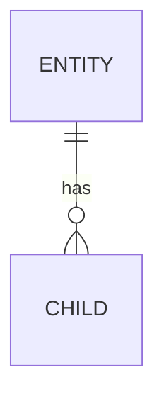

# TRD (<Platform>): <feature name>

> Platform spoke. The shared context, system design, and API contract live in the
> **hub** (`./TRD.md`) — link to them, don't copy. This doc covers only what is
> specific to <Platform>.

| | |
|---|---|
| **Status** | Draft |
| **Platform** | <Backend / Android / iOS / Web> |
| **Author** | <engineer> |
| **Hub** | [./TRD.md](./TRD.md) |
| **Date** | <YYYY-MM-DD> |

## Open Decisions

> Gaps where the design/PRD is silent or ambiguous. The AI records them here and **recommends — it does not decide or build them.** Resolve (or explicitly defer) each before the affected slice is built. Decide → update the design → re-groom the item (it folds into the section below, status → *decided*). **Build only *decided* scope** — never fill a gap by adding extra.

| # | Gap / ambiguity | Why it's a gap (what would otherwise be guessed) | Options (★ = recommended) | Status |
|---|-----------------|--------------------------------------------------|---------------------------|--------|
| D1 | <what's unspecified> | <the scope that'd be invented if unanswered> | ★ <opt A> / <opt B> / <opt C> | pending / decided: <choice> |

## 1. Scope (this platform)
_Approved: <YYYY-MM-DD>_

<What this platform must build for the feature. Link to the hub for the why and the contract.>

## 2. Design
_Approved: <YYYY-MM-DD>_

<Clients (Android/iOS/Web): screens, navigation, state management, components — each screen's elements bound to the **canonical components** in `docs/basics/03-ui-architecture.md` → component inventory (name them; no match → ask, register-on-create).
Backend: services, modules, internal design.>

**Approach (ladder rung):** <required — e.g. "rung 2: reuse existing `ScannerActivity`" / "rung 7: new component, ruled out rungs 2–5 because …">

**Multi-step flows** *(only if the feature has a stepped flow / wizard — grounded in `docs/basics/04-ux-conventions.md` → Multi-step / wizard flows; deviation → Open Decision)*

| Flow: <name> | Decision |
|--------------|----------|
| Steps (ordered) | <step 1 → step 2 → step 3, each with its screen + design ref> |
| Flow state lives in | <one flow-level store — per convention> |
| Per-step validation + AC | <what each step must validate before Next; assertable> |
| Cross-step dependencies | <e.g. step 3's options depend on step 1's choice → refetch on change> |
| Partial save / resume | <draft persisted? where (→ `08-data-cache.md` flow drafts)> |
| Final commit | <atomic — all-or-nothing at the end; mid-flow error recovery> |

## 3. Assets
_Approved: <YYYY-MM-DD>_

<Icons, images, drawables, SF Symbols, SVGs, fonts, colors this platform needs. For each asset climb the asset ladder (checked against the real project): **exact match exists → reuse it**; **no exact but a similar one exists → reuse/adapt it (name it)**; **none → create new**. Only "create new" rows become work slices.>

> ⚠️ Every **adapt / similar-match** row needs **user re-validation** — "similar enough" is a judgment call (wrong size/state/brand variant). The *Why it fits* note and the *Re-validated?* flag must be filled before the asset is treated as resolved.

| Asset needed | Exact match? | Closest similar (path) | Decision | Why it fits (for adapt) | Re-validated? | Where it lives |
|--------------|--------------|------------------------|----------|-------------------------|---------------|----------------|
| <e.g. QRIS scan icon> | <yes/no + path> | <path to similar> | reuse / adapt / **create** | <why the similar one works> | <user ✓ / pending> | <Android drawable / iOS asset catalog / web /assets> |

## 4. Data / persistence
_Approved: <YYYY-MM-DD>_

<Clients: local models, caching, offline storage (Room / CoreData / IndexedDB) — shared server data follows `docs/basics/08-data-cache.md` → *Shared server-state sync* (canonical query keys, mutation→invalidation, real-time events); never a private copy of an entity another feature owns.
Backend: DB schema and migrations — every FK's on-delete action implements the **decided edge** in the hub's Entities-touched / `06-domain-model.md` (mismatch = contradiction, per `07-database.md`).>

## 5. Performance impact
_Approved: <YYYY-MM-DD>_

<Performance implications of the chosen approach, and why it wins over the alternatives.>

**Backend** (use for the backend spoke)

| Aspect | Expected | Notes |
|--------|----------|-------|
| Latency (p50 / p95) | | |
| Throughput / load | | |
| Queries / N+1 risk | | |
| Caching | | |
| Scaling limit | | |

**Client** (use for Android / iOS / Web spokes)

| Aspect | Expected | Notes |
|--------|----------|-------|
| Screen load / render time | | |
| Jank / FPS (lists, animations) | | |
| App size / web bundle size | | |
| Memory footprint | | |
| Network payload / # calls | | |
| Battery / data usage (mobile) | | |
| Offline / cache behavior | | |

## 6. Release considerations
_Approved: <YYYY-MM-DD>_

<Clients: min OS/SDK version, permissions, store submission, forced update, feature-flag gating, backward compatibility with old app versions.
Backend: deploy steps, migration ordering, rollback.>

## 7. Risks / dependencies (this platform)
_Approved: <YYYY-MM-DD>_

- **Risk:** <what could go wrong> — *Mitigation:* <how>
- **Dependency:** <other team / hub item / ordering>

## 8. Work slices
_Approved: <YYYY-MM-DD>_

> This platform's candidate tickets. Mirror the summary up into the hub.
> AC must include the **integrity rules** the hub decided, not just the happy path: entity
> **visibility** ("the picker lists active parents only"), **on-delete behavior** ("a row whose
> parent was archived shows 'unavailable', never dangles/crashes"), **freshness** ("a new source
> item appears in this list per the decided freshness"), and per-step AC for any multi-step flow.

- [ ] <slice> — acceptance criteria: <AC>
- [ ] <slice> — acceptance criteria: <AC>
