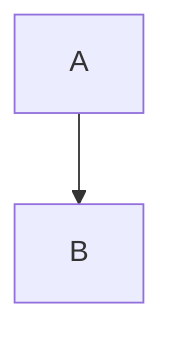
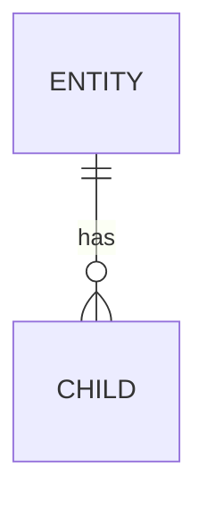

# TRD (<Platform>): <feature name>

> Platform spoke. The shared context, system design, and API contract live in the
> **hub** (`./TRD.md`) — link to them, don't copy. This doc covers only what is
> specific to <Platform>.
>
> **Gate 0 writes this file as a skeleton:** the header filled, §1's *Gate-0 notes*,
> *Carry-forward answers* when any were given, and every approved outline heading with `_Pending_`
> on the line under it — no section prose, and no `<…>` placeholder left anywhere (the hook blocks
> one). A section's gate turns its `_Pending_` into `_Approved: <YYYY-MM-DD> · <commit>_` and writes
> its prose below it.

| | |
|---|---|
| **Status** | Draft |
| **Platform** | <Backend / Android / iOS / Web> |
| **Author** | <engineer> |
| **Hub** | [./TRD.md](./TRD.md) |
| **Hub alignment** | <`reviewed YYYY-MM-DD · hub rev <commit / hub's last approval date>` — or `NOT REVIEWED`. Set by the hub-alignment review; **stale the moment a hub section changes**. `do-planning` won't plan a spoke whose stamp is missing or older than the hub's last change.> |
| **Alignment rounds** | <objective-violation count per round, oldest first — e.g. `7 · 4 · 4`; every round lands here, clean or not> |
| **Date** | <YYYY-MM-DD> |

## Open Decisions

> Gaps where the design/PRD is silent or ambiguous. The AI records them here and **recommends — it
> does not decide or build them.** Resolve (or explicitly defer) each before the affected slice is
> built. Decide → update the design → re-groom the item (it folds into the section below, status →
> *decided*). Where a chosen option names a **mechanism**, the decided status also names **the test
> that will prove it** — the hub's flow-binding idiom (hub §2) — which lands as a numbered AC in §8
> and is written downstream, never run here. **A mechanism amended twice stops being amended —
> escalate to the user.** **Build only *decided* scope** — never fill a gap by adding extra. (An
> amendment is any change to a decided row's chosen option or its proving test — count it in
> `amended <n>`.)

| # | Gap / ambiguity | Why it's a gap (what would otherwise be guessed) | Options (★ = recommended — always the product-quality / world-standard option, never the cheapest) | Status |
|---|-----------------|--------------------------------------------------|---------------------------|--------|
| D1 | <what's unspecified> | <the scope that'd be invented if unanswered> | ★ <opt A> / <opt B> / <opt C> | pending / decided: <choice> · proven by <act → assert> · amended <n> / decided: auto ★<choice> (ratify) |

## Carry-forward answers

> Answers the user gave at one gate that belong to a later section — written here the moment they
> are given, so a fresh session still has them. One line each, naming its section; that section's
> gate folds the line in and deletes it, and the block goes with its last line.

- §<n>: <the answer, as the user gave it>

## 1. Scope (this platform)
_Approved: <YYYY-MM-DD> · <commit>_

<What this platform must build for the feature. Link to the hub for the why and the contract.>

**Gate-0 notes** — Gate 0's approved record, written with the skeleton:
- **Understanding confirmed** <YYYY-MM-DD>: <this platform's scope · key facts · constraints · what
  exists to reuse · the hub §2 dependencies that concern it>
- **Approach chosen:** <the option picked where the code allowed more than one, and why>
- **Evolution:** <hub §1's *Gate-0 notes*, cited — plus only the evolution specific to this
  platform>

## 2. Design
_Approved: <YYYY-MM-DD> · <commit>_

<Clients (Android/iOS/Web): screens, navigation, state management, components — each screen's
elements bound to the **canonical components** in `docs/basics/03-ui-architecture.md` → component
inventory (name them; no match → ask, register-on-create).
Backend: services, modules, internal design.>

**Approach (ladder rung · world-wide standard):** <required — name the rung AND the
industry-standard way today, e.g. "rung 2: reuse existing `ScannerActivity` · standard: agrees" — a
conflict is surfaced per the tiered rule (security-grade standard overrides; style conflicts become
options)>

```mermaid
graph TD
  A --> B
```

**Multi-step flows** *(only if the feature has a stepped flow / wizard — grounded in
`docs/basics/04-ux-conventions.md` → Multi-step / wizard flows; deviation → Open Decision)*

| Flow: <name> | Decision |
|--------------|----------|
| Steps (ordered) | <step 1 → step 2 → step 3, each with its screen + design ref> |
| Flow state lives in | <one flow-level store — per convention> |
| Per-step validation + AC | <what each step must validate before Next; assertable> |
| Cross-step dependencies | <e.g. step 3's options depend on step 1's choice → refetch on change> |
| Partial save / resume | <draft persisted? where (→ `08-data-cache.md` flow drafts)> |
| Final commit | <atomic — all-or-nothing at the end; mid-flow error recovery> |

## 3. Assets
_Approved: <YYYY-MM-DD> · <commit>_

<Icons, images, drawables, SF Symbols, SVGs, fonts, colors this platform needs. For each asset climb
the asset ladder (checked against the real project): **exact match exists → reuse it**; **no exact
but a similar one exists → reuse/adapt it (name it)**; **none → create new**. Only "create new" rows
become work slices.>

> **Resolve assets via the asset search flow (spoke grooming).** When grooming a platform spoke,
> identify the assets the feature needs. For each one, search in this order and **stop at the first
> hit** (create-new is the last resort — ladder rung 2, reuse before build):
> 1. **Registry** — search `docs/basics/17-asset-registry.md` (from `do-project-setup`) by name and
>    tags.
> 2. **Assets module** — if there's no registry, or no match in it, check the actual
>    asset-providing module/package. Find *where assets live* from
>    `docs/basics/03-ui-architecture.md` (asset locations / design-system module), then search there
>    directly (Android `res/drawable`·`mipmap`, iOS asset catalogs/SF Symbols, web `assets`/icon
>    set).
> 3. **Ask the user** — if still no match: ask whether to **(a) scan the whole project** for it, or
>    **(b) create a new asset**. Don't silently full-scan (expensive) or silently create.
>
> At each level: **exact match → reuse** (cite its path); **similar (not exact) → adapt + flag for
> user re-validation**; **create-new** only after step 3. Record the outcome in the table below.

> ⚠️ Every **adapt / similar-match** row needs **user re-validation** — "similar enough" is a
> judgment call (wrong size/state/brand variant). The *Why it fits* note and the *Re-validated?*
> flag must be filled before the asset is treated as resolved.

| Asset needed | Exact match? | Closest similar (path) | Decision | Why it fits (for adapt) | Re-validated? | Where it lives |
|--------------|--------------|------------------------|----------|-------------------------|---------------|----------------|
| <e.g. QRIS scan icon> | <yes/no + path> | <path to similar> | reuse / adapt / **create** | <why the similar one works> | <user ✓ / pending> | <Android drawable / iOS asset catalog / web /assets> |

## 4. Data / persistence
_Approved: <YYYY-MM-DD> · <commit>_

<Clients: local models, caching, offline storage (Room / CoreData / IndexedDB) — shared server data
follows `docs/basics/08-data-cache.md` → *Shared server-state sync* (canonical query keys,
mutation→invalidation, real-time events); never a private copy of an entity another feature owns.
Backend: DB schema and migrations — every FK's on-delete action implements the **decided edge** in
the hub's Entities-touched / `06-domain-model.md` (mismatch = contradiction, per `07-database.md`).>

```mermaid
erDiagram
  ENTITY ||--o{ CHILD : has
```

## 5. Performance impact
_Approved: <YYYY-MM-DD> · <commit>_

<Performance implications of the chosen approach, and why it wins over the alternatives.>

**Backend** (use for the backend spoke)

| Aspect | Expected | Notes |
|--------|----------|-------|
| Latency (p50 / p95) | | |
| Throughput / load | | |
| Queries / N+1 risk | | |
| Caching | | |
| Scaling limit | | |

**Client** (use for Android / iOS / Web spokes)

| Aspect | Expected | Notes |
|--------|----------|-------|
| Screen load / render time | | |
| Jank / FPS (lists, animations) | | |
| App size / web bundle size | | |
| Memory footprint | | |
| Network payload / # calls | | |
| Battery / data usage (mobile) | | |
| Offline / cache behavior | | |

## 6. Release considerations
_Approved: <YYYY-MM-DD> · <commit>_

<Clients: min OS/SDK version, permissions, store submission, forced update, feature-flag gating,
backward compatibility with old app versions.
Backend: deploy steps, migration ordering, rollback.>

## 7. Risks / dependencies (this platform)
_Approved: <YYYY-MM-DD> · <commit>_

- **Risk:** <what could go wrong> — *Mitigation:* <how>
- **Dependency:** <other team / hub item / ordering>

## 8. Acceptance criteria
_Approved: <YYYY-MM-DD> · <commit>_

> **The canonical, numbered AC registry for this platform** — the single list every later phase keys
> on: `do-slicing` tasks carry these IDs, `do-planning` stages declare `Covers: AC-3, AC-7`,
> `do-development` writes each stage's failing test from them, `do-testing`'s coverage table proves
> each one at a level, and gate presentations cite them with their essence (`AC-3 — an archived
> parent shows "unavailable"`). **IDs are stable — never renumbered once approved** (a retired AC
> keeps its row, struck through with a note). One sentence per AC, **assertable** (an observable
> behavior, not a vibe). **Source makes the hub's rules enumerated, not implied:** every hub
> decision that touches this platform — each integrity cell (visibility · on-delete · freshness),
> each feature-flow step, each flow-binding — lands here as its own numbered AC (that's what
> hub-alignment check #8 verifies mechanically), alongside slice-specific and per-step (wizard) AC.
> **Behavior only:** a profile-doc registration or other bookkeeping (a row in the asset registry,
> the code inventory, the design tokens) is not an AC — it is the plan's and the stage packet's
> checklist. **One behavior per AC, provable inside one work slice:** *"opening the panel shows the
> pid; closing it closes the stream"* is two ACs when the panel and the stream land in different
> slices — an AC whose clauses need two slices' code is split here rather than halved later in the
> plan. **Every Source names its anchor** — a hub section, or an approved decision of this spoke
> that itself cites one; an AC with no anchor is a scope proposal, not a row.

| ID | Acceptance criterion (assertable, one sentence) | Source |
|----|--------------------------------------------------|--------|
| AC-1 | <e.g. the picker lists **active** parents only — archived/draft never appear> | hub §2 integrity: visibility of <EntityA> |
| AC-2 | <a row whose parent was archived shows "unavailable" — never a dangling ref or crash> | hub §2 integrity: on-delete edge <A→B> |
| AC-3 | <a new source item appears in this list <per the decided freshness — e.g. without app restart>> | hub §2 flow binding <element> |
| AC-4 | <step 2's Next stays disabled until <fields> are valid> | multi-step flow <name>, step 2 |
| AC-5 | <slice-specific behavior> | slice <n> |

## 9. Work slices
_Approved: <YYYY-MM-DD> · <commit>_

> This platform's candidate tickets. Mirror the summary up into the hub.
> **Slices reference AC by ID — never restate the criterion's prose here** (one source of truth, §8;
> a restated AC forks and drifts). Every AC in §8 is claimed by ≥ 1 slice, and every slice claims
> ≥ 1 AC — an unclaimed AC is unbuilt scope, an AC-less slice is untestable work.

- [ ] <slice> — AC: <AC-1, AC-3>
- [ ] <slice> — AC: <AC-2, AC-4, AC-5>
