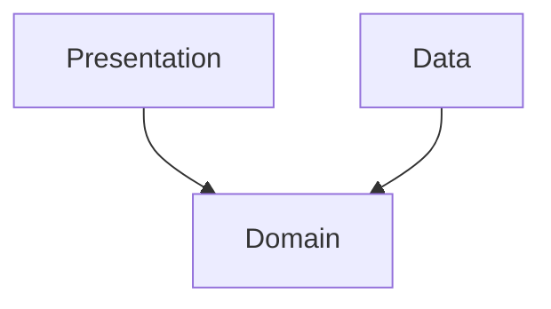

# Architecture — <project name>

_Generated by `do-project-setup` · commit `<hash>` · <YYYY-MM-DD>_

## Style

<Architecture style — e.g. clean/layered, MVVM, MVI, hexagonal, microservices, modular monolith. State it plainly; if unclear, mark `UNKNOWN — needs human input`.>

## Layers & dependency rule

<If layered/clean: the layers (e.g. presentation / domain / data) and the dependency rule — what depends on what, what depends on nothing. If not layered, say so.>



## Code structure

<The **complete** directory layout — where each kind of code physically lives. **Describe the full structure — do not shorten, collapse, or elide any directory** (no "…" / "etc." placeholders): every directory annotated, and the significant files named, so a reader sees the *whole* layout, not a sample. Also mark **where each feature is bounded** (which part of the tree belongs to which feature) so `do-planning` knows exactly where new work like `recipe` lands and what it may import.>

```
<repo-root>/
  <dir>/            # <what lives here>
  <dir>/
    <subdir>/       # <…>
  <dir>/            # <…>
```

## Module / package map

| Module / package | Responsibility | Feature(s) | Depends on (modules) |
|------------------|----------------|------------|----------------------|
| <path> | <what it does> | <feature it implements> | <modules> |

> **Module vs feature dependencies:** this table is **code/module** dependencies. Feature-to-feature
> dependencies live in [feature-map](./16-feature-map.md), and the entities each feature owns/consumes in
> [domain-model](./06-domain-model.md). A feature can span several modules — keep the physical (here),
> feature (feature-map), and logical (domain-model) views consistent.

## Key components

<The handful of components a newcomer must understand — entry points, core services, shared kernels.>

## Notes

<Cross-cutting patterns (DI, event bus, navigation), and anything non-obvious a change author must respect.>
