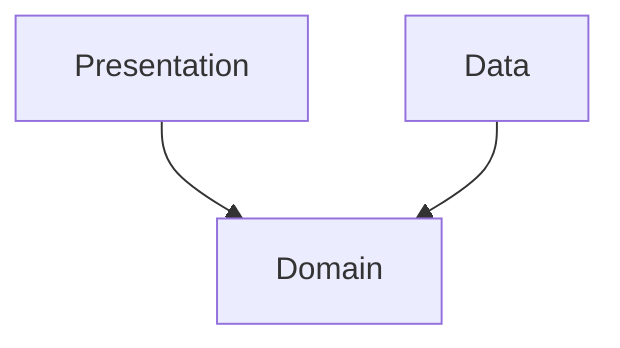

# Architecture — <project name>

_Generated by `do-project-setup` · commit `<hash>` · approved <YYYY-MM-DD>_

## Style

<Architecture style — e.g. clean/layered, MVVM, MVI, hexagonal, microservices, modular monolith. State it plainly; if unclear, mark `UNKNOWN — needs human input`.>

## Layers & dependency rule

<If layered/clean: the layers (e.g. presentation / domain / data) and the dependency rule — what depends on what, what depends on nothing. If not layered, say so.>


```mermaid
graph TD
  Presentation --> Domain
  Data --> Domain
```

## Code structure

<The **complete** directory layout — where each kind of code physically lives. **Describe the full structure — do not shorten, collapse, or elide any directory** (no "…" / "etc." placeholders): every directory annotated, and the significant files named, so a reader sees the *whole* layout, not a sample. Also mark **where each feature is bounded** (which part of the tree belongs to which feature) so `do-planning` knows exactly where new work like `recipe` lands and what it may import.>

```
<repo-root>/
  <dir>/            # <what lives here>
  <dir>/
    <subdir>/       # <…>
  <dir>/            # <…>
```

## Module / package map

| Module / package | Responsibility | Feature(s) | Depends on (modules) |
|------------------|----------------|------------|----------------------|
| <path> | <what it does> | <feature it implements> | <modules> |

> **Module vs feature dependencies:** this table is **code/module** dependencies. Feature-to-feature
> dependencies live in [feature-map](./16-feature-map.md), and the entities each feature owns/consumes in
> [domain-model](./06-domain-model.md). A feature can span several modules — keep the physical (here),
> feature (feature-map), and logical (domain-model) views consistent.

## Layer interaction & wiring patterns

> The dependency rule above says **what may depend on what**; this section says **how a call actually
> crosses each boundary** — the concrete recipe every feature follows so wiring is identical across
> features (feature A on `@Binds`, feature B on `@Provides`, feature C calling the impl directly is
> exactly the drift this kills). **One row per boundary, each with a real example from this codebase**
> — fill for the platforms this repo has (backend · Android · iOS · web); an unlayered repo documents
> its simpler contract (e.g. "all API access through the `apiClient` wrapper; one data-hook per entity").
> `do-planning` names each stage's wiring per these patterns; `do-development` builds by them and its
> conformance review checks the *pattern*, not just the dependency rule. Reusable **units** themselves
> are cataloged in [19-code-inventory](./19-code-inventory.md).

| Boundary / concern | The pattern here (with a real example) |
|--------------------|----------------------------------------|
| **Interface → implementation → binding** | <where the interface lives (domain), where the impl lives (data), **where and how it's bound** — e.g. Android: `domain/repository/XRepository.kt` ← `data/repository/XRepositoryImpl.kt`, bound in `data/di/RepositoryModule.kt` via Hilt `@Binds`; backend: route → service → repository via <Spring beans / NestJS providers / FastAPI Depends>; iOS: protocol in domain, impl injected via <initializer / factory / Environment>; web: <factory function / context provider / plain module import>> |
| **How the upper layer calls it** | <e.g. use-case receives the interface by constructor injection; ViewModel calls the use-case, never the repository; web component calls the entity's data-hook, never `fetch`> |
| **Async across the boundary** | <e.g. `suspend`/`Flow` at the domain boundary · async/await · Promise/React Query — where the async type changes, if it does> |
| **Errors across the boundary** | <e.g. data returns `Result`/sealed error, presentation maps it to the UX error state (`04-ux-conventions`) — never a raw exception reaching the UI, per `10-conventions` error handling> |
| **DTO ↔ entity mapping** | <where mapping lives (the data edge), mapper naming — a DTO never leaks past the data layer> |
| **Common/shared code consumption** | <what belongs in `core/*` vs stays feature-local, how modules expose/consume it (e.g. `api` vs `implementation`), and the **promotion rule**: to core only at the second real consumer — see `19-code-inventory`'s promotion section> |

## Key components

<The handful of components a newcomer must understand — entry points, core services, shared kernels.>

## Notes

<Cross-cutting patterns (DI, event bus, navigation), and anything non-obvious a change author must respect.>
