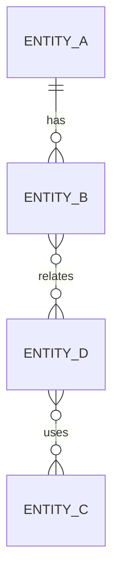

# Domain Model — <project name>

_Generated by `do-project-setup` · commit `<hash>` · <YYYY-MM-DD>_

> The app's **logical entities, their relationships, and cross-feature ownership** — the single shared
> truth every feature binds to, so interdependent features (a feature consuming entities that other
> features own) model the same entities the same way instead of each inventing their own. This owns the *logical* model;
> **physical storage → `07-database.md`**, **transport → `15-api-reference.md`**, **feature graph → `16-feature-map.md`** —
> cross-link, don't duplicate.
>
> **Codebase-state-agnostic:** capture what the code models today; where an entity/relationship isn't
> defined yet, **establish it with the user**; where the code models the same entity **inconsistently**
> (two features disagree), record it in *Contradictions* — that inconsistency is a bug source, not a
> detail to smooth over.

## Entities

> One row per core entity. **Owned by** = the single feature that is the source of truth and may write it.
> **Consumed by** = features that read (or, rarely, write) it, and how — this is what keeps a consumer's
> view (recipe's menu list) in sync with the owner.

| Entity | Owned by (feature) | Key fields | Lifecycle / states · what consumers see | Consumed by (feature · read/write) | Source-of-truth endpoint |
|--------|--------------------|-----------|------------------------------------------|------------------------------------|--------------------------|
| <EntityA> | <feature-1> | <id, name, …> | <e.g. draft / active / archived · consumers list **active only**> | <feature-3 · read> | <`GET /entity-a`> |
| <EntityB (child of A)> | <feature-1> | <id, entityAId, name> | <follows EntityA> | <feature-3 · read> | <`GET /entity-a/:id/entity-b`> |
| <EntityC> | <feature-2> | <id, name> | <e.g. active / discontinued · pickers show active> | <feature-3 · read> | <`GET /entity-c`> |
| <EntityD> | <feature-3> | <id, entityBId, …> | <e.g. draft / published> | <—> | <`GET /entity-d`> |

> **Lifecycle matters to consumers:** an entity's states and *which states each consumer may see* are
> part of the contract — an undefined visibility rule is how a picker shows archived entities (looks
> like a sync bug, is actually an unspecified rule). Each visibility rule becomes testable AC.

## Relationships

| From | To | Cardinality | On delete / change (decided) | Notes |
|------|-----|-------------|------------------------------|-------|
| <EntityA> | <EntityB> | 1 — many | <e.g. cascade: deleting A deletes its Bs> | |
| <EntityB> | <EntityD> | many — many | <e.g. restrict: a B with Ds can't be deleted — or archive + D flagged "unavailable"> | |
| <EntityD> | <EntityC> | many — many | <e.g. restrict / soft-delete: Ds referencing a removed C show it discontinued, never dangle> | |

> **On-delete/on-change is decided per edge, never left implicit** — cascade · restrict · soft-delete/archive,
> plus what a consumer does with a dangling reference. An undecided edge is the classic cross-feature
> integrity bug (an entity pointing at a deleted parent). Each decision becomes testable AC.

## Contradictions & debt

> Where the current code models the same entity/relationship **inconsistently** across features (a real
> bug source). Flag each with where it diverges and the intended single model — resolve as an Open
> Decision downstream, don't silently build on the contradiction. "None found" if consistent.

| Entity / relationship | Where it diverges | Intended single model |
|-----------------------|-------------------|-----------------------|
| | | |

## Notes

<Invariants that cross features (e.g. "a child entity must reference a parent that exists"), lifecycle/ownership
rules, and anything a change to a shared entity must respect.>
