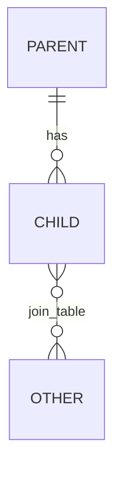

# Database — <project name>

_Generated by `do-project-setup` · commit `<hash>` · <YYYY-MM-DD>_

> The **complete** schema, fully described — every table, every column, every relationship. **Do not
> shorten, sample, or elide** (a partial schema is how a table gets re-invented or a relationship
> misread). Migrations remain the **executable truth**: this doc is the complete readable mirror,
> kept current by the keep-profile-current rule (every schema change updates this doc in the same
> change) and re-checked by refresh/reconcile. If doc and migrations disagree, the doc is stale — refresh it.

## Engine(s)

<e.g. PostgreSQL 15, Redis (cache), plus any read replicas / sharding. Mark `UNKNOWN` if undetermined.>

## Schema overview



## Tables — complete, one block per table

> **Every table, every column** — name · type · null/default · constraints — plus the **owning feature**
> (→ [domain-model](./06-domain-model.md)) and indexes. No table omitted.

### <`table_name`> — owned by <feature>

| Column | Type | Null / default | Constraints |
|--------|------|----------------|-------------|
| <id> | <uuid> | <not null> | <pk> |
| <name> | <text> | <not null> | <unique per tenant> |
| <status> | <enum: e.g. draft/active/archived> | <not null, default draft> | <lifecycle → domain-model> |

**Indexes:** <e.g. `idx_<table>_status`>

### <`join_table`> — owned by <feature> (join)

| Column | Type | Null / default | Constraints |
|--------|------|----------------|-------------|
| <left_id> | <uuid> | <not null> | <fk → left_table.id> |
| <right_id> | <uuid> | <not null> | <fk → right_table.id> |
| <extra column, e.g. quantity> | <numeric> | <not null> | |

<!-- one block per table — continue for ALL tables -->

## Relationships & constraints — enforce the domain model

> **Every FK, with its ON DELETE / ON UPDATE action — and the action must match the decided edge in
> [domain-model](./06-domain-model.md) → Relationships.** A mismatch (doc says *restrict*, DB cascades) is a
> **contradiction to flag**, not a detail: it's the "child pointing at a deleted parent" bug enforced nowhere.

| FK | From → To | On delete | On update | Matches domain-model edge? |
|----|-----------|-----------|-----------|----------------------------|
| <fk_child_parent> | <child.parent_id → parent.id> | <CASCADE / RESTRICT / SET NULL> | <—> | <yes / MISMATCH — flag> |

## Migrations

<Migration tool/approach (Flyway, Liquibase, Room, Prisma, etc.), where migrations live, how they run, ordering rules. **Link the migrations directory** — the executable truth this doc mirrors.>

## Seed / test data

<How to load **domain-realistic data** into a dev DB — seed scripts / fixtures / anonymized dump, the command, and what it creates (parent entities with their children, so a consuming feature's flow has real data to consume). This is what Boot & Smoke and the cross-feature data-flow tests run against — placeholder/random data hides the bugs they exist to catch.>

```
# Seed dev database
<command>
```

## Notes

<Indexing/performance conventions, soft-delete, multi-tenancy, data retention — anything a schema change must respect.>
