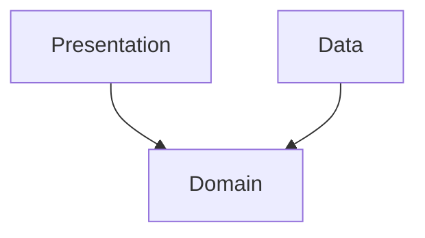

# Architecture — <project name>

_Generated by `do-project-setup` · commit `<hash>` · <YYYY-MM-DD>_

## Style

<Architecture style — e.g. clean/layered, MVVM, MVI, hexagonal, microservices, modular monolith. State it plainly; if unclear, mark `UNKNOWN — needs human input`.>

## Layers & dependency rule

<If layered/clean: the layers (e.g. presentation / domain / data) and the dependency rule — what depends on what, what depends on nothing. If not layered, say so.>

## Module / package map

| Module / package | Responsibility | Depends on |
|------------------|----------------|------------|
| <path> | <what it does> | <modules> |

## Key components

<The handful of components a newcomer must understand — entry points, core services, shared kernels.>

## Notes

<Cross-cutting patterns (DI, event bus, navigation), and anything non-obvious a change author must respect.>
