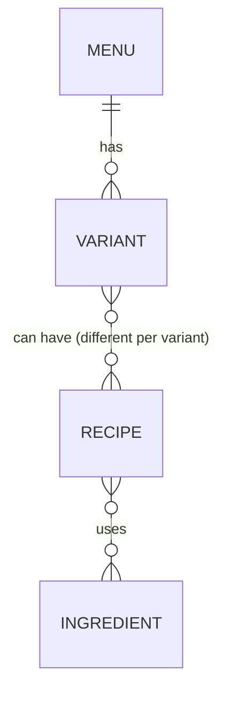

# Domain Model — <project name>

_Generated by `do-project-setup` · commit `<hash>` · <YYYY-MM-DD>_

> The app's **logical entities, their relationships, and cross-feature ownership** — the single shared
> truth every feature binds to, so interdependent features (e.g. recipe ← menu, ingredients) model the
> same entities the same way instead of each inventing their own. This owns the *logical* model;
> **physical storage → `database.md`**, **transport → `api-reference.md`**, **feature graph → `feature-map.md`** —
> cross-link, don't duplicate.
>
> **Codebase-state-agnostic:** capture what the code models today; where an entity/relationship isn't
> defined yet, **establish it with the user**; where the code models the same entity **inconsistently**
> (two features disagree), record it in *Contradictions* — that inconsistency is a bug source, not a
> detail to smooth over.

## Entities

> One row per core entity. **Owned by** = the single feature that is the source of truth and may write it.
> **Consumed by** = features that read (or, rarely, write) it, and how — this is what keeps a consumer's
> view (recipe's menu list) in sync with the owner.

| Entity | Owned by (feature) | Key fields | Consumed by (feature · read/write) | Source-of-truth endpoint |
|--------|--------------------|-----------|------------------------------------|--------------------------|
| <Menu> | <menu> | <id, name, …> | <recipe · read> | <`GET /menus`> |
| <Variant> | <menu> | <id, menuId, name> | <recipe · read> | <`GET /menus/:id/variants`> |
| <Ingredient> | <ingredients> | <id, name, unit> | <recipe · read> | <`GET /ingredients`> |
| <Recipe> | <recipe> | <id, variantId, steps> | <—> | <`GET /recipes`> |

## Relationships

| From | To | Cardinality | Notes |
|------|-----|-------------|-------|
| <Menu> | <Variant> | 1 — many | |
| <Variant> | <Recipe> | many — many | a variant can have different recipes |
| <Recipe> | <Ingredient> | many — many | recipe picks ingredients (qty per) |

## Contradictions & debt

> Where the current code models the same entity/relationship **inconsistently** across features (a real
> bug source). Flag each with where it diverges and the intended single model — resolve as an Open
> Decision downstream, don't silently build on the contradiction. "None found" if consistent.

| Entity / relationship | Where it diverges | Intended single model |
|-----------------------|-------------------|-----------------------|
| | | |

## Notes

<Invariants that cross features (e.g. "a Recipe must reference a Variant that exists"), lifecycle/ownership
rules, and anything a change to a shared entity must respect.>
