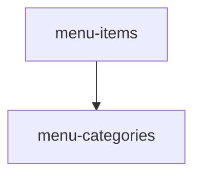

# Feature Map — <project name>

_Generated by `do-project-setup` · commit `<hash>` · <YYYY-MM-DD>_

> The catalog of the app's **features** and how they depend on each other — so a new
> feature's dependency on an existing one is **noticed at grooming**, reused (not re-built or
> broken), and sequenced correctly. This is "search before build" at the feature level, the
> companion to `asset-registry.md` (assets) and `api-reference.md` (contracts).
>
> Kept current by **register-on-create**: `do-grooming` appends each newly groomed feature and
> records its dependencies. Each feature's authoritative detail lives in its
> `docs/development/<feature>/TRD.md`; this map is the index + the dependency graph.

## Features

| Feature | Purpose | Entry points (screens / routes) | Owned endpoints | Owned tables / data | Depends on | Status |
|---------|---------|--------------------------------|-----------------|---------------------|------------|--------|
| <menu-categories> | <manage category list> | <`/menu/categories`, MenuCategoriesPage> | <`GET/POST /categories`> | <`categories`> | <—> | shipped |
| <menu-items> | <manage items in a category> | <`/menu/items`> | <`GET/POST /items`> | <menu-categories (needs category id + list)> | in-progress |

> **Status** = shipped · in-progress · planned. A feature that another one *depends on* must be at
> least the depended-on part **shipped** before the dependent feature's affected slice is built —
> otherwise the dependent slice is blocked (see `do-grooming` / `do-planning`).

## Dependency graph

## Notes

<Cross-feature conventions a change author must respect: shared data models owned by one feature,
features that must not be broken by changes elsewhere, known tight couplings.>
