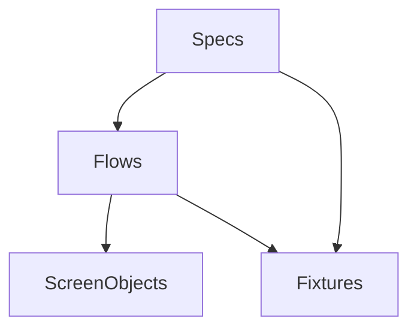

# Test Architecture — <test project name>

_Generated by `do-regression-setup` · test-project commit `<hash>` · <YYYY-MM-DD>_

## Layering

<The test project's layers and the dependency rule between them — e.g.:
**specs** (test cases; no direct selectors/HTTP) → **flows** (reusable user journeys, e.g. "login", "create entity") → **screen-objects** (one per screen; owns that screen's locators + actions) → **fixtures/helpers** (data builders, API client, auth, seed/reset). A spec never reaches past a flow/screen-object to raw selectors — that's the rule that keeps a UI change a one-file fix.
**Subject = the built app, black-box:** specs are **whole-app user journeys** (login → … → outcome, cross-feature where the coverage map says so) driven through the real UI/API of the deployed/installed artifact — there are no component-level tests here (those live in the app repo's `do-testing`), and nothing in this project imports app code.>



## Code structure

<The **complete** directory layout — **do not shorten, collapse, or elide any directory** (no "…"): every directory annotated, significant files named, so a reader sees the whole layout. Mark where new specs/flows/screen-objects land.>

```
<test-project-root>/
  <dir>/            # <what lives here>
```

## Screen-object inventory

> **Search here before creating a screen-object** (same discipline as the app's component inventory):
> one screen-object per app screen, owning its locators + actions. New ones are **registered here on
> create** — an unregistered screen-object is how duplicates creep in.

| Screen-object | App screen (widget-spec) | Path | Key actions |
|---------------|--------------------------|------|-------------|
| <EntityListScreen> | <app: `widget-spec/<screen>.md`> | <path> | <open, search, expectRow> |

## Naming & conventions

<Spec/flow/screen-object naming, file naming, tag placement, one-assertion-per-test vs journey style — the "match the suite" rules for new tests.>
