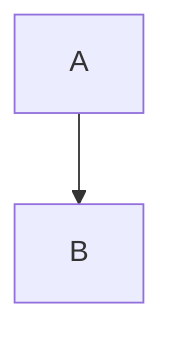

# Tech-Debt TRD: <improvement name>

> **Gate 0 writes this file as a skeleton:** the header filled, §1's *Gate-0 notes*,
> *Carry-forward answers* when any were given, and every approved outline heading with `_Pending_`
> on the line under it — no section prose, and no `<…>` placeholder left anywhere (the hook blocks
> one). A section's gate turns its `_Pending_` into `_Approved: <YYYY-MM-DD> · <commit>_` and writes
> its prose below it.

| | |
|---|---|
| **Status** | Draft |
| **Author** | <engineer> |
| **Platforms** | <Backend / Android / iOS / Web — those affected> |
| **Behavior change?** | <No — behavior-preserving / Yes — describe> |
| **Spokes** | <only if the work spans platforms: links to per-platform spokes, each with its **hub alignment** stamp (`✅ reviewed YYYY-MM-DD · hub rev <hash/date>` / ⚠️ stale / ❌ not reviewed). Editing a hub section makes every ✅ stale. This row is the hub's one home for those stamps; each spoke, from `do-grooming`'s `TRD-spoke-template.md`, carries its own `Hub alignment` and `Alignment rounds` rows.> |
| **Hub review** | <❌ not reviewed · rounds `n · n` while rounds run — every round appends its objective-violation count; a clean pass makes it ✅ reviewed YYYY-MM-DD · rev `<hash>` · rounds `n · n · 0`. No spoke is groomed before ✅> |
| **Date** | <YYYY-MM-DD> |

## Carry-forward answers

> Answers the user gave at one gate that belong to a later section — written here the moment they
> are given, so a fresh session still has them. One line each, naming its section; that section's
> gate folds the line in and deletes it, and the block goes with its last line.

- §<n>: <the answer, as the user gave it>

## 1. Condition (what's wrong today)
_Approved: <YYYY-MM-DD> · <commit>_

<The problem, where it lives, and the evidence — a metric, incident, or painful change. Ground in
the real code.>

**Gate-0 notes** — Gate 0's approved record, written with the skeleton:
- **Register:** <`TD-<n>` — the existing row, or the one added at step 0>
- **Blast radius:** <the consuming features, from `16-feature-map.md` + `06-domain-model.md`>
- **Worth doing now** <YYYY-MM-DD>: <the user's go-ahead at step 2, and the cost of delay behind
  it>
- **Understanding confirmed** <YYYY-MM-DD>: <intended behavior change: none / which · measurable
  target>

## 2. Cost of delay vs cost to fix
_Approved: <YYYY-MM-DD> · <commit>_

<Why fix now: what the debt costs if left (incidents, slow delivery, risk) vs the rough cost to fix.
If speculative with no real cost → recommend deferring.>

## 3. Current state (as-is)
_Approved: <YYYY-MM-DD> · <commit>_

<How it works now — the structure/flow being changed.>

## 4. Target state
_Approved: <YYYY-MM-DD> · <commit>_

**Approach (ladder rung · world-wide standard):** <required — name the rung AND the
industry-standard way today, e.g. "rung 2 (reuse): extract shared logic into existing util ·
standard: agrees" — conflicts surfaced per the tiered rule>

<How it works after. What changes, what stays. Keep the smallest change that fixes the condition.>

## 5. Measurable success
_Approved: <YYYY-MM-DD> · <commit>_

| Metric | Baseline (now) | Target | How measured |
|--------|----------------|--------|--------------|
| <e.g. p95 latency> | | | |
| <e.g. crash rate / build time / coverage> | | | |

## 6. Regression safety & acceptance criteria
_Approved: <YYYY-MM-DD> · <commit>_

<Behavior-preserving proof: characterization tests to add **first** (pin current behavior), existing
tests that must stay green, risky areas to guard. Any intended behavior change stated explicitly.
**If shared entities/contracts/cache wiring are touched:** the consuming features (blast radius,
from `16-feature-map.md` impact analysis) and their **flow-binding tests (create + destructive)**
that must stay green.>

> **The canonical, numbered AC registry for this improvement** — the single list every later phase
> keys on: §8's slices and `do-slicing`'s tasks carry these IDs, `do-planning` stages declare
> `Covers: AC-2, AC-5`, `do-development` writes each stage's failing test from them, `do-testing`'s
> coverage table proves each one. **IDs are stable — never renumbered once approved** (a retired AC
> keeps its row, ~~struck through~~ with a note). One sentence per AC, **assertable** (an observable
> behavior, not a vibe). **Source makes the behavior-preserving claim enumerated, not implied:**
> each §5 metric target, each consuming feature's flow binding, and any intended behavior change
> lands here as its own numbered AC.

| ID | Acceptance criterion (assertable, one sentence) | Source |
|----|--------------------------------------------------|--------|
| AC-1 | <`<module>` behaves identically — the characterization suite for <behavior> stays green> | §3 current state |
| AC-2 | <p95 latency of `<endpoint>` is ≤ <target> under <load>> | §5 metric |
| AC-3 | <consuming feature <name>'s create + destructive flow-binding tests stay green> | `16-feature-map.md` blast radius |
| AC-4 | <the one intended behavior change: <what changes, observably>> | §4 target state |

## 7. Rollback
_Approved: <YYYY-MM-DD> · <commit>_

<How to revert safely — feature flag, phased rollout, revert plan. Especially for shared/hot-path
changes.>

## 8. Change manifest
_Approved: <YYYY-MM-DD> · <commit>_

> Structured handoff. Feeds ticket-slicing.

**Modules / files touched**
- <path>

**Cross-feature blast radius** (features consuming what's refactored — from `16-feature-map.md`)
- <feature → the binding/flow that must stay green — or "none">

**Regression-safety plan (tests first)**
- <characterization test to add>

**Measurable success + check**
- <metric → target → how verified>

**Dependencies & risks**
- <item>

**Implied work slices** (candidate tickets) — **reference AC by ID from §6, never restate the
criterion's prose here** (one source of truth; a restated AC forks and drifts). Every AC in §6 is
claimed by ≥ 1 slice and every slice claims ≥ 1 AC — an unclaimed AC is unproven work, an AC-less
slice is untestable work.
- [ ] <slice> — AC: <AC-1, AC-2>
- [ ] <slice> — AC: <AC-3, AC-4>

## Open Decisions
_Status: <open / decided: <choice> · proven by <act → assert> · amended <n>>_

<Gaps the grooming surfaced that need a human call (2–3 options, mark one — the ★ always the
quality/world-standard option, never the cheapest). **Where the chosen option names a mechanism, the
decision also names the test that will prove it** — specified, not run; a mechanism amended twice
stops being amended — escalate to the user. Undecided items block the affected slice.> (An
amendment is any change to a decided row's chosen option or its proving test — count it in
`amended <n>`.)
